<p align="center">
  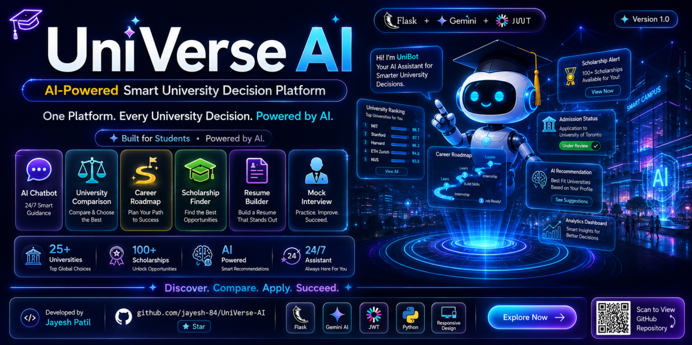
</p>

# UniVerse AI Student Helpdesk Portal

A highly secure, customizable, and production-ready AI-powered Student Helpdesk Portal application. This system is designed to allow colleges, departments, or universities to immediately deploy an interactive assistant that answers common student inquiries (admission criteria, tuition fees, exam /hedules, and course syllabus) while supporting robust administrative CRUD dashboards.

The backend is built on **Flask** and features a **Dual-Engine Response Pipeline**:
1. **Local NLP Mode (Offline)**: Matches student queries against a modular university facts database to return structured data instantly.
2. **Gemini AI Mode (Online)**: Leverages Google's Gemini models (`gemini-1.5-flash`) with dynamic RAG vector match lookup and context injection.

---

## Production Security & Optimization Audit Features

* **JWT Session Authentication**: Fully secured JWT cookie authentication using `bcrypt` password hashing, dynamic `secure` flags (HTTPS enforcement in production), and HttpOnly session cookies.
* **SQL Injection & XSS Protection**: All database queries are structured through SQLAlchemy ORM parameters. All HTML templates enforce Jinja2 sanitization.
* **Rate Limiting**: Sliding-window IP rate limit protection (`@rate_limit`) on authenticating endpoints (`/api/login`, `/api/register`) to prevent brute-force attacks.
* **centralized Error Handler**: Centralized server exception logging with auto-rollback (`db.session.rollback()`) to prevent SQLite database locks and keep raw database trace logs hidden from clients.
* **Database Query Optimization**: Complete indexing (`index=True`) on foreign key columns and frequently queried filters to accelerate response times.
* **REST API Pagination**: Pagination enabled on core APIs, communicating metadata via standard HTTP Headers (`X-Total-Count`, `X-Limit`, etc.) to keep full backward-compatibility with flat array client JSON structures.
* **Browser Caching & Asset Compression**: GZIP compression hook combined with HTTP `Cache-Control` header caching policies for `/static/*` files.

---

## Project Structure

```text
├── app.py                      # Main Flask application and server routes
├── models.py                   # SQLAlchemy database schemas with indexations
├── utils.py                    # Token authentications, decorators, and JWT helper utilities
├── controllers/
│   └── crud_factory.py         # Dynamic REST API CRUD controller factory with pagination
├── services/
│   └── realtime_fetcher.py     # Live crawler university facts parser and crawler engine
├── docs/
│   ├── API_DOCUMENTATION.md    # API endpoints payload and headers documentation
│   └── DEPLOYMENT_GUIDE.md     # Production Gunicorn, systemd, and Nginx deployment instructions
├── static/                     # Custom stylesheet and JS bundle files
├── templates/                  # Jinja2 HTML layout pages (index.html, portal.html)
└── requirements.txt            # System dependencies
```
## Screenshots

### 🏠 Home
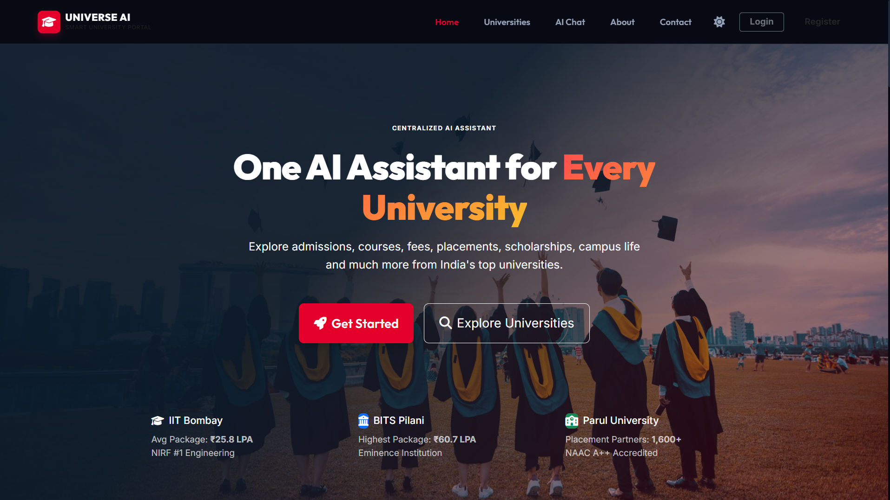

### 📊 Dashboard
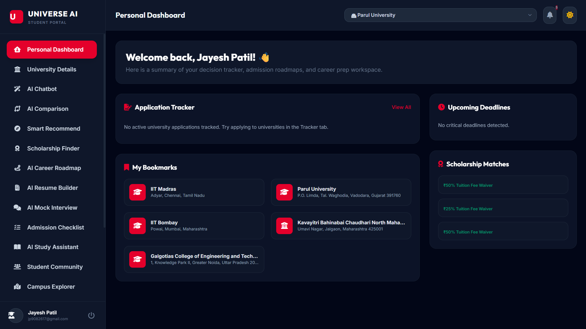

### 🏫 University
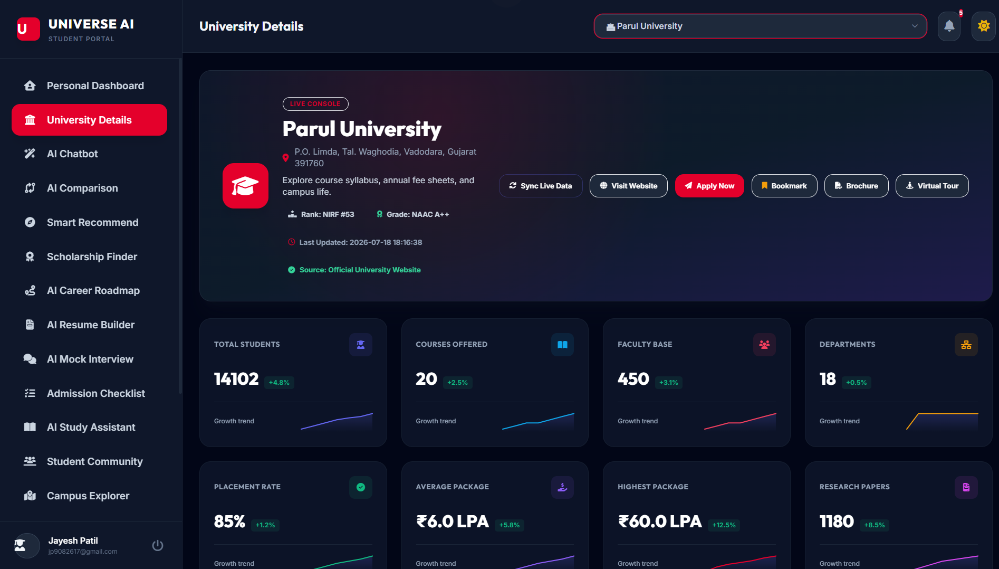

### 🎓 Scholarship Finder
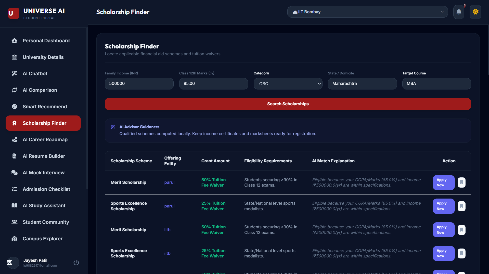

### 🤖 AI Chatbot
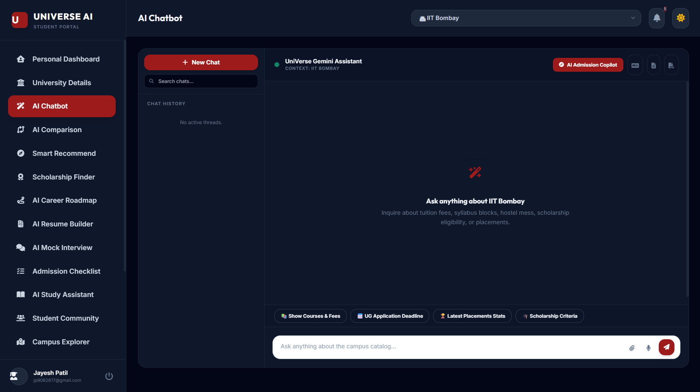

### ⚖️ AI Comparison
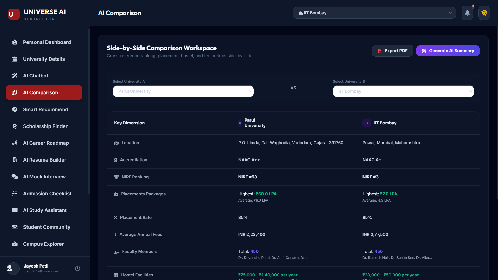

### 🗺️ Career Roadmap
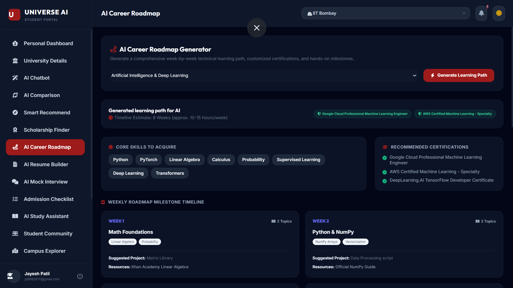

### 📄 Resume Builder
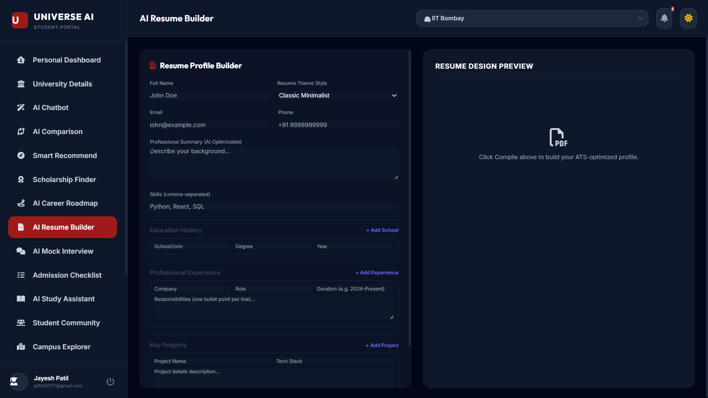

### 🎤 Mock Interview
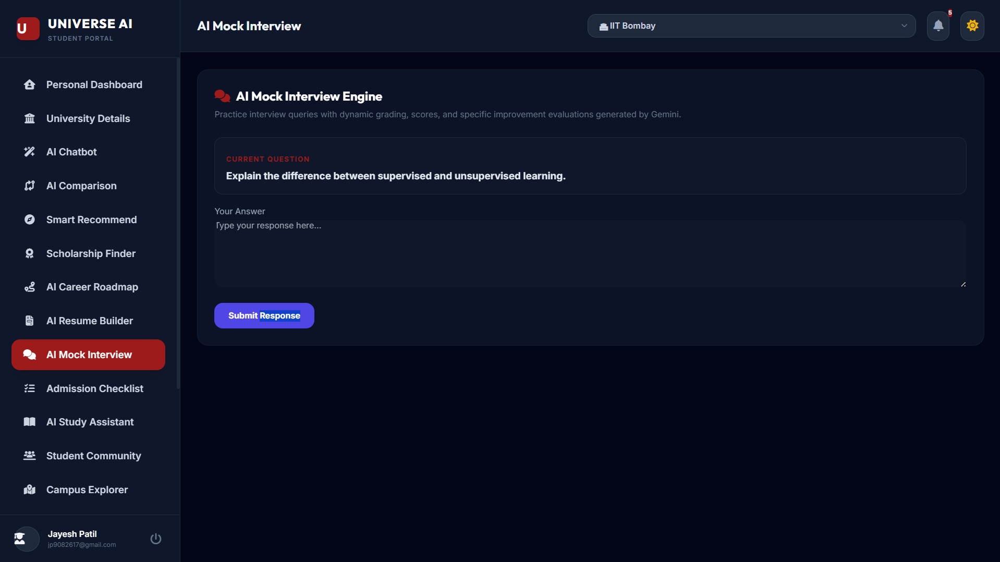

### 📌 Application Tracker
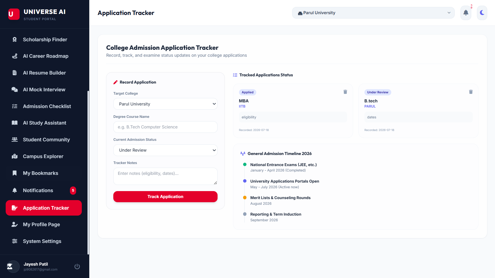

### 🔔 Notifications
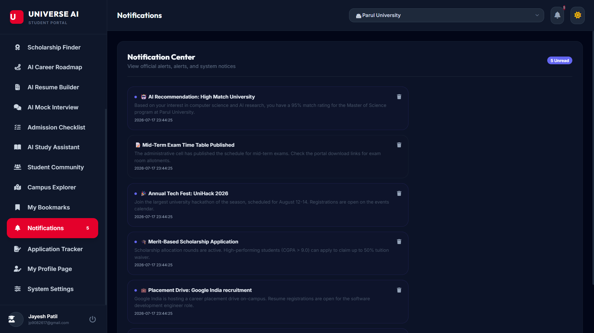

### 👤 Profile
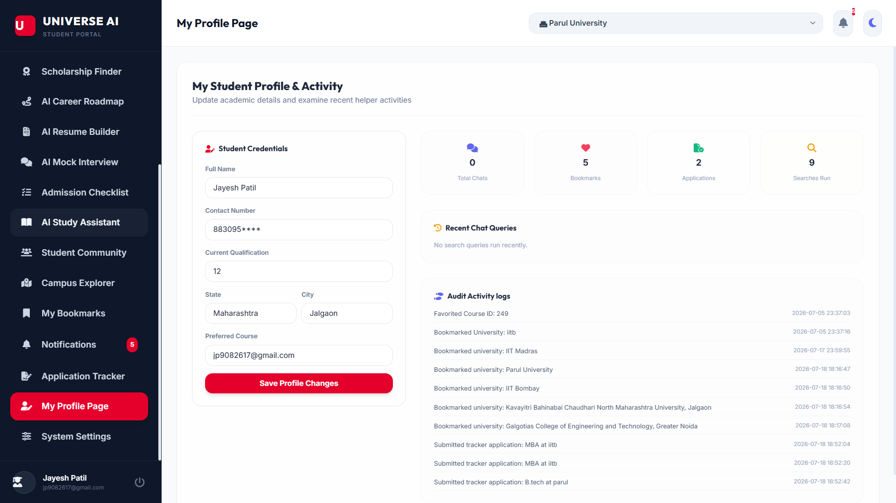

---

## Installation & Setup

Please refer to the following documents for deployment instructions:
1. **Local Installation**: Set up dependencies and start the app locally by following the guides in [docs/DEPLOYMENT_GUIDE.md](file:///C:/Users/SARVADNYA/Desktop/Universe%20AI/docs/DEPLOYMENT_GUIDE.md).
2. **API Definition**: Check JSON payload structures and parameters in [docs/API_DOCUMENTATION.md](file:///C:/Users/SARVADNYA/Desktop/Universe%20AI/docs/API_DOCUMENTATION.md).
3. **Environment Setup**: Copy `.env.example` to `.env` and fill out keys.

<p align="center">

</p>

# 🎓 UniVerse AI

An AI-powered Smart University Decision Platform that helps students explore universities, compare institutions, receive AI-powered career guidance, and manage their admission journey in one place.

## 🚀 Features

- 🤖 AI Chatbot (Gemini API)
- 🏛️ University Information
- ⚖️ University Comparison
- 🎯 AI Career Roadmap
- 🎓 Scholarship Finder
- 📄 AI Resume Builder
- 🎤 AI Mock Interview
- ✅ Admission Checklist
- 📌 Application Tracker
- 🔖 Bookmark Universities
- 🔔 Notification Center
- 👤 Student Dashboard
- 🔐 JWT Authentication
- 📊 Real-time University Data Integration

## 📷 Screenshots

### 🏠 Home


---

### 📊 Dashboard


---

### 🤖 AI Chatbot


---

### 🎓 University Information


---

### ⚖️ University Comparison


---

### 🎯 AI Career Roadmap


---

### 💰 Scholarship Finder


---

### 📄 AI Resume Builder


---

### 🎤 AI Mock Interview


---

### 📌 Application Tracker


---

### 🔔 Notification Center


---

### 👤 User Profile


## 🛠️ Tech Stack

- Python
- Flask
- SQLite
- HTML
- CSS
- JavaScript
- Bootstrap
- Google Gemini API
- JWT Authentication

## 📂 Project Structure

```
app.py
controllers/
services/
templates/
static/
models.py
requirements.txt
```

## ⚙️ Installation

```bash
git clone https://github.com/jayesh-84/UniVerse-AI.git
cd UniVerse-AI
pip install -r requirements.txt
python app.py
```

## 🎯 Future Enhancements

- AI College Predictor
- AI Study Planner
- Mobile App
- OCR Document Verification
- Voice Assistant
- Multi-language Support

## 👨‍💻 Developer

**Jayesh Patil**

B.Tech CSE (AI) | Parul University

⭐ If you found this project interesting, don't forget to star the repository.
